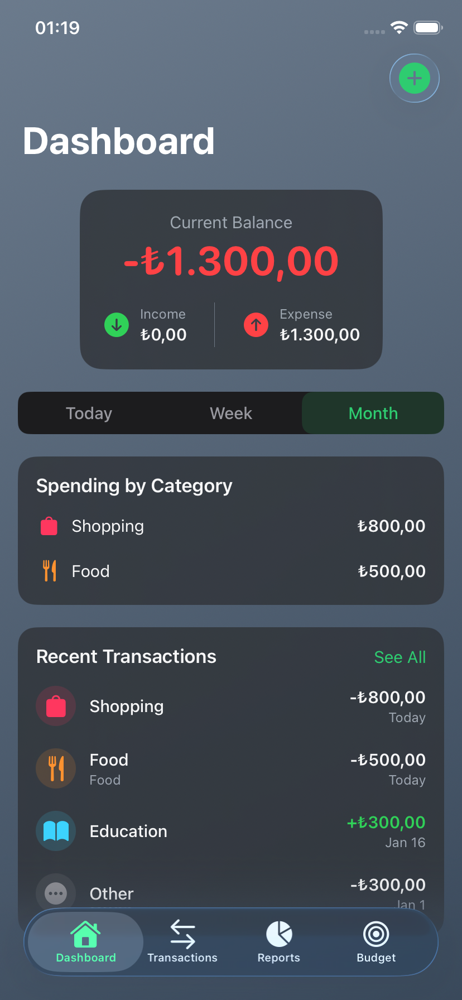
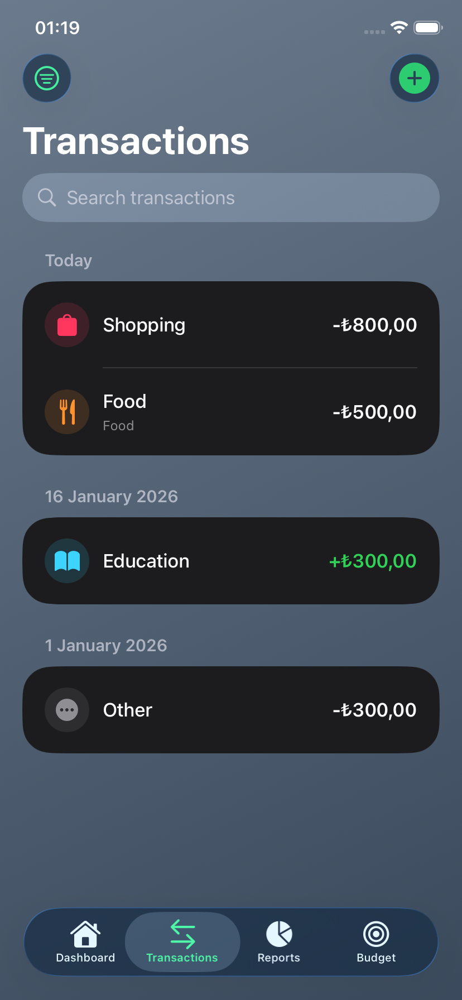
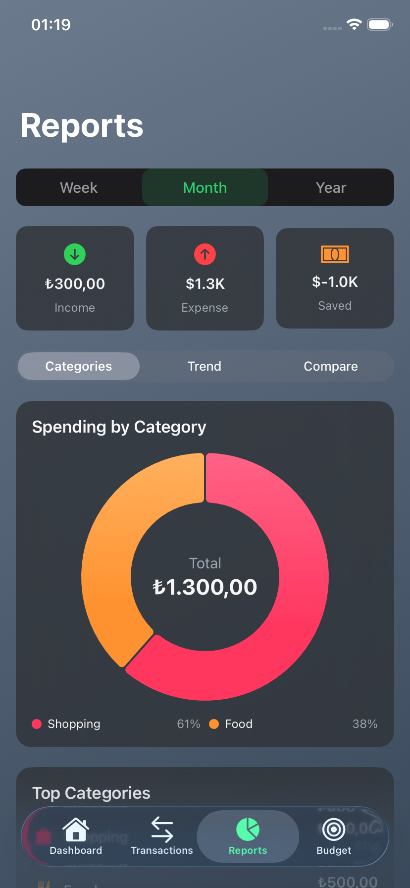
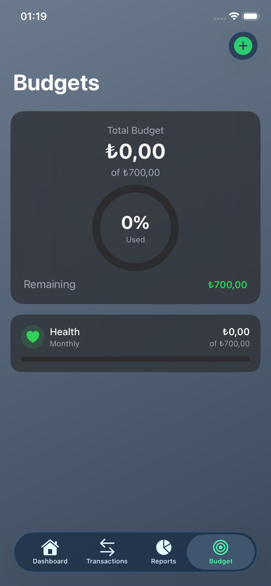

# SpendWise 💰

A personal finance tracking app built with modern iOS development practices.


## Features

- 📊 **Real-time expense tracking** - Monitor your spending as it happens
- 📈 **Interactive spending analytics** - Visualize trends with Swift Charts
- 🎯 **Budget goals and notifications** - Set limits and get alerts when approaching them
- 💾 **Offline-first** - All data stored locally with Core Data
- 🔄 **Recurring transactions** - Support for daily, weekly, monthly, and yearly recurring items

## Screenshots

| Dashboard | Transactions | Reports | Budget |
|:---------:|:------------:|:-------:|:------:|
|  |  |  |  |

## Architecture

### MVVM + Clean Architecture

```
┌─────────────────────────────────────────────────────────┐
│                      Presentation                        │
│  ┌─────────────┐    ┌─────────────┐    ┌─────────────┐ │
│  │    View     │◄───│  ViewModel  │◄───│   Service   │ │
│  │  (SwiftUI)  │    │ (@MainActor)│    │ (Protocol)  │ │
│  └─────────────┘    └─────────────┘    └─────────────┘ │
└─────────────────────────────────────────────────────────┘
                              ▲
                              │
┌─────────────────────────────┴───────────────────────────┐
│                       Data Layer                         │
│  ┌─────────────┐    ┌─────────────┐    ┌─────────────┐ │
│  │ Repository  │◄───│   Entity    │◄───│  Core Data  │ │
│  │ (Protocol)  │    │   (Model)   │    │  (Storage)  │ │
│  └─────────────┘    └─────────────┘    └─────────────┘ │
└─────────────────────────────────────────────────────────┘
```

### Key Principles

- **Protocol-oriented design** for testability
- **Dependency Injection** for loose coupling
- **async/await** for modern concurrency
- **SOLID principles** throughout

## Tech Stack

| Technology | Purpose |
|------------|---------|
| Swift 6.0 | Primary language |
| SwiftUI | UI Framework |
| Combine | Reactive programming |
| Core Data | Local persistence |
| Swift Charts | Data visualization |
| XCTest | Unit & UI testing |
| GitHub Actions | CI/CD pipeline |

## Project Structure

```
SpendWise/
├── App/
│   ├── SpendWiseApp.swift              # App entry point
│   └── ContentView.swift               # Main tab navigation
├── Core/
│   ├── Models/
│   │   ├── Transaction.swift           # Transaction model
│   │   ├── Category.swift              # Category enum
│   │   └── Budget.swift                # Budget model
│   ├── Services/
│   │   ├── CoreDataManager.swift       # Core Data stack
│   │   ├── TransactionService.swift    # Transaction business logic
│   │   ├── TransactionRepository.swift # Transaction persistence
│   │   ├── BudgetService.swift         # Budget business logic
│   │   └── BudgetRepository.swift      # Budget persistence
│   ├── Entities/
│   │   ├── TransactionEntity.swift     # Core Data entity
│   │   └── BudgetEntity.swift          # Core Data entity
│   └── Utilities/
│       ├── AppTheme.swift              # Centralized color palette
│       ├── DateFormatter+Extensions.swift
│       └── CurrencyFormatter.swift
├── Features/
│   ├── Dashboard/
│   │   ├── DashboardView.swift
│   │   └── DashboardViewModel.swift
│   ├── Transactions/
│   │   ├── TransactionListView.swift
│   │   ├── AddTransactionView.swift
│   │   └── TransactionViewModel.swift
│   ├── Reports/
│   │   ├── ReportsView.swift
│   │   ├── ReportsViewModel.swift
│   │   └── ChartViews/
│   │       ├── CategoryPieChartView.swift
│   │       ├── TrendLineChartView.swift
│   │       └── ComparisonChartView.swift
│   └── Budget/
│       ├── BudgetView.swift
│       ├── AddBudgetView.swift
│       └── BudgetViewModel.swift
└── Resources/
    ├── Assets.xcassets
    └── SpendWise.xcdatamodeld
```

## Getting Started

### Requirements

- Xcode 16.0+
- iOS 17.0+
- Swift 6.0

### Installation

1. Clone the repository:
```bash
git clone https://github.com/BeyzaZngn/SpendWise.git
```

2. Open in Xcode:
```bash
cd SpendWise
open SpendWise.xcodeproj
```

3. Build and run on simulator or device

### Running Tests

```bash
# Unit Tests
xcodebuild test -scheme SpendWise -destination 'platform=iOS Simulator,name=iPhone 16'

# UI Tests
xcodebuild test -scheme SpendWise -destination 'platform=iOS Simulator,name=iPhone 16' -only-testing:SpendWiseUITests
```

## Key Implementation Highlights

### Protocol-Oriented Repository Pattern

```swift
protocol TransactionRepositoryProtocol {
    func fetchAll() async throws -> [Transaction]
    func save(_ transaction: Transaction) async throws
    func delete(_ transaction: Transaction) async throws
}

class TransactionService {
    private let repository: TransactionRepositoryProtocol
    
    init(repository: TransactionRepositoryProtocol) {
        self.repository = repository
    }
}
```

### Modern Concurrency with async/await

```swift
func loadTransactions() async {
    isLoading = true
    do {
        transactions = try await repository.fetchAll()
    } catch {
        errorMessage = error.localizedDescription
    }
    isLoading = false
}
```

### Testable Architecture

```swift
class TransactionServiceTests: XCTestCase {
    var sut: TransactionService!
    var mockRepository: MockTransactionRepository!
    
    func testFetchTransactions_ReturnsExpectedCount() async throws {
        // Given
        mockRepository.mockTransactions = [.sample(), .sample()]
        
        // When
        await sut.loadTransactions()
        
        // Then
        XCTAssertEqual(sut.transactions.count, 2)
    }
}
```

## CI/CD

This project uses GitHub Actions for continuous integration:

- ✅ Build verification on every push
- ✅ Unit test execution
- ✅ UI test execution
- ✅ Code coverage reporting
- ✅ SwiftLint code quality checks

## Future Enhancements

- [ ] iCloud sync for multi-device support
- [ ] Widgets for quick expense entry
- [ ] Apple Watch companion app
- [ ] Data export (CSV, PDF)
- [ ] Biometric authentication
- [ ] Smart spending insights with ML

## Contributing

Contributions are welcome! Please feel free to submit a Pull Request.

---

Built with by [Beyza Zengin](https://github.com/BeyzaZngn)
